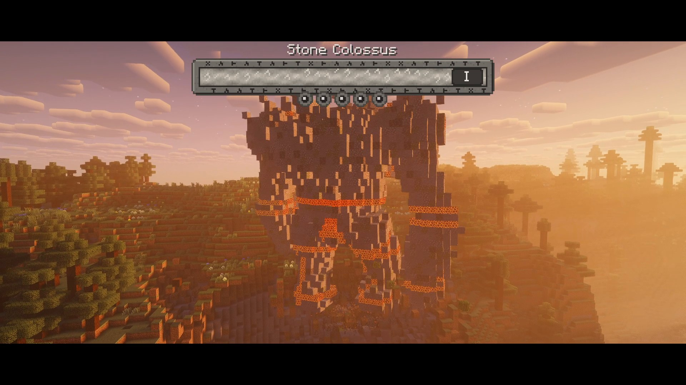

# The Waking World

*The world has an old, forgotten history - and it is waking up.*

[](https://youtu.be/K47KIgOEuzc)

**[Watch the trailer](https://youtu.be/K47KIgOEuzc)** (1:51) - **[Download on CurseForge](https://www.curseforge.com/minecraft/mc-mods/the-waking-world)** - **[Releases](https://github.com/Lovkar-Squid/the-waking-world/releases)** - **[Discord](https://discord.gg/BVztrTtXFu)**

A standalone mod for **NeoForge 1.21.1**. Somewhere under the hills, six kinds of sleeping giants wait
for a horn. Find the letters the dead left behind, follow them to the shrines and the vaults, gather
what a rite needs, and wake a **Colossus** built from the land it sleeps in - forty blocks of stone,
ice, sand, moss, prismarine or earth that stomps, hurls boulders, uproots trees and picks you up. Break
its cores, bring it down, and it collapses into a real ruin you can walk through... or turn back with an
hourglass. Six hearts later, a key opens the way to the **Titan** in the End.

No library mods, no dependencies. Made by **Lovkar & Claude**. License GPL-3.0-or-later.

> **0.1.0 beta** (current: beta.5). Everything below is playable; balance, worldgen rarity and the art are still moving.
> Please report bugs and ideas in the [issue tracker](https://github.com/Lovkar-Squid/the-waking-world/issues).

## What is in the world

**Colossi.** Six kinds - Stone, Earth, Sand, Ice, the Sea and the Grove - each with its own body,
signature moves, battle theme and glowing cores. A giant is built from the actual blocks round its
shrine, so no two look the same. Fights have three phases; stomps, slams and thrown boulders tear real
craters (all configurable), the giant breaks through trees and walks through water instead of round it,
and a dying colossus takes half a minute to come down, limb by limb. Its cores are the weak points:
hit them with anything, break enough of them, and the giant can finally die. Every kill leaves a
**Colossus Heart** - and the giant's own **music disc**, its battle theme for your jukebox.

**Shrines and rites.** Standing Stones, Barrows, Sand Tombs, Frost Cairns, Sunken Shrines and
Overgrown Sanctums hide an **Altar of the Sleeper**. Lay the offerings on it - a **Sleeper's Ember**, the
**Rune** of the shrine's land and a gift of that land - and sound the **Horn of Waking**. The rite
itself is a show: runes climb, the ground answers, and the giant rises out of the earth past the altar.

**Dungeons.** Sleeper's Vaults (embers, runes, the horn, traps), the Drowned Cistern (Drowned Keepers),
the Ember Forge (Ember Wraiths and a Rune Sentinel guarding the master's vault) and, in the End, the
Void Reliquary with the **Void Sigil**. Four custom mobs with their own looks and sounds; a few of them
also wander the world at night - Stone Thralls in ruins, Ember Wraiths in deserts and badlands, Drowned
Keepers in swamps and rivers.

**Ruins, hamlets and kingdoms.** Abandoned cottages, wells, watchtowers, chapels, graveyards with
crypts, camps and whole empty villages, weathered by age. And walled **kingdoms**: a moat, eight towers,
barbicans, a market town and a keep with a great hall, a throne and a treasury. Guards (archers,
knights, spearmen) keep the peace, townsfolk trade - a surveyor sells maps to shrines, vaults and the
next kingdom - and the king grants an audience with news of what has woken and fallen in your world.
Rob the treasury or raise a hand against him and the town turns on you; kill him and the kingdom
crowns a successor.

**Dead Letters.** Letters found in ruins and vaults were written for *your* world: they point at the
nearest shrine, vault, dungeon or kingdom in paces and winds, name the offerings a rite needs, and
carry a compass needle on the page. With a free Google AI Studio key the letters are written by Gemini
about the actual places and events of your world, and every letter is **read aloud in its writer's own
voice** - the words light up as they are spoken, a horn on the page plays, pauses and stops. Without a
key, the built-in letters are used, silently.

**The Waker's Almanac.** A guide book you get on your first join (also `book + amethyst shard`): what
the giants are, what to do, where to look - it explains without spoiling.

**The Titan.** Craft the **Key of the Titan** from the six Sigils the giants leave behind, find the Void
Sigil and take the Dragon Egg with you: the Titan Arena floats in the End. Six lesser altars round the
great one want the runes of every land, and then the Titan rises - twice the size of any colossus,
with its own music and its own boss bar. Beat it for the **Heart of the End** (two hearts more per
Heart, five times), and the **Titan's Gate** opens on the arena's rim to carry you home.

**The Hourglass of Restoration.** Craft it from a Heart and turn the whole battlefield back to how it
was - every block, every tree, exactly.

## Getting started

1. Install NeoForge 21.1.x for Minecraft 1.21.1 and drop the jar in `mods/`. Works on servers and in
   singleplayer; clients need the mod too.
2. Read the Almanac you are given, then explore: ruins are common, letters are in their chests.
3. Follow a letter to a vault for embers, runes and the Horn; follow another to a shrine.
4. Wake something. Bring a bow or a lot of nerve.

There is an advancement tab, *The Waking World*, that marks the way from the first letter to the Titan.

## Configuration

Everything is in NeoForge's config screen (Mods -> The Waking World -> Config) or in the files:

- `config/wakingworld-server.toml` - `[colossi]` terrain damage, trample, crater scale, flying-block
  and collapse limits, the death mound; `[letters]` `geminiLetters`, `geminiApiKey`, `geminiModel`,
  `letterLanguage`, `voicedLetters`, `voiceModel`; `[rites]` the cost of every offering type and the
  toggles for the Titan's Sigil, Egg and lesser altars; `[titan]` whether the Dragon Egg is
  indestructible and whether every dragon leaves one.
- `config/wakingworld-client.toml` - camera shake, boss music, `readLettersAloud` (a voiced letter
  reads itself when opened; off, the horn on the page still plays it on demand).

### Gemini letters and voices (optional, free)

The letters and their voices come from Google's Gemini through **your own** API key. The free tier is
plenty for a normal world - a letter is one short request, a voice one more - and nothing is billed
unless you turn billing on in Google Cloud yourself.

1. Open https://aistudio.google.com/apikey and sign in with a Google account.
2. **Create API key** -> *Create API key in new project* (a new project gets its own free quota; you can
   make another one later if you ever hit the daily limit). Copy the key - it starts with `AIza`.
3. Open `config/wakingworld-server.toml` (the instance's `config/` folder in singleplayer, the
   server's `config/` on a server) and set

   ```toml
   [letters]
   geminiLetters = true
   geminiApiKey = "AIza..."
   voicedLetters = true
   ```

   or do the same in the in-game config screen (Mods -> The Waking World -> Config -> Letters).
4. Play. The next letter you find is written about your world; its voice is made in the background
   (a minute or two the first time) and the letter opens once it is ready.

The key never leaves the server and is never shown to players; on any error the mod falls back to the
built-in letters and to silent ones. What does leave the server when Gemini is on is the letter prompt -
the names of the nearby structures and the recent events of your world (a giant woken, a king crowned),
never chat, player names or anything personal - sent to Google's Gemini API with your key. With it off,
the mod makes no network requests at all. `geminiModel` defaults to `gemini-3.6-flash` (when Google retires
a model, the mod follows the successor its error message names); `voiceModel` defaults to
`gemini-2.5-flash-preview-tts`, whose free tier is more generous than the 3.1 preview's ten voices a day.
Five writers, five voices: a weary miner, a quiet walker, an old monk, an excited child, a gruff
sergeant. Voices are stored in the world (`data/wakingworld/voices/`), so a letter is only ever
spoken once.

### Recommended modpack

**[Lovkar's Waking World Ultimate](https://www.curseforge.com/minecraft/modpacks/lovkars-waking-world-ultimate)**
on CurseForge is the mod with everything below already set up - the shaders and our settings, the
performance mods, Waystones, backpacks, Better Combat, dungeons for the road - about fifty projects,
NeoForge 1.21.1. Install it from the CurseForge app and only add your Gemini key. The list is in
[docs/MODPACK.md](docs/MODPACK.md).

### Recommended shaders

The trailer and the screenshots were made with **Complementary Reimagined r5.9** patched by
**Euphoria Patches 1.10.0**, on Iris + Sodium (Iris 1.8.x and Sodium 0.6.x for 1.21.1). Colossi are
real entities built from block models, so shaders light them like the terrain they came from - it is
worth it.

1. Install [Sodium](https://www.curseforge.com/minecraft/mc-mods/sodium) (0.6.13) and
   [Iris](https://www.curseforge.com/minecraft/mc-mods/irisshaders) (1.8.12) for NeoForge 1.21.1, and
   put [Complementary Reimagined](https://www.curseforge.com/minecraft/shaders/complementary-reimagined)
   r5.9 into `shaderpacks/` (Unbound works too, if you prefer its look).
2. Install the [Euphoria Patches](https://www.curseforge.com/minecraft/mc-mods/euphoria-patches) mod
   (1.10.0) - it patches Complementary on the first start and leaves a pack named
   `ComplementaryReimagined_r5.9 + EuphoriaPatches_1.10.0` next to it in `shaderpacks/`. Select that
   one in Iris (Options -> Video Settings -> Shader Packs).
3. Optional - our settings: copy
   [`docs/shaders/ComplementaryReimagined_r5.9 + EuphoriaPatches_1.10.0.txt`](docs/shaders/) into
   `shaderpacks/` next to the pack folder (Iris keeps a pack's settings in `<pack name>.txt`; for a
   `.zip` pack the file is `<pack name>.zip.txt`), then reselect the pack. They turn on coloured
   lighting (512), high shadow and cloud quality, generated normals, interactive foliage, the End
   nebula and the Blood Moon - fine on a mid-range GPU at 1080p60; on weaker cards lower *Colored
   Lighting* and *Shadow Quality* first.

Without shaders everything still works - the giants' cores and runes glow on their own.

## Commands

`/wakingworld` (operators): `summon <terrain|stone|earth|sandstone|ice|prismarine|moss|titan> [height] [instant]`,
`kill` (every colossus), `rite <x y z>` (start the rite at that altar with no offerings), `restore` (put the
nearest finished fight's land back, as the Hourglass does), `target <entity>`, `letter` / `letter gemini`
(write a letter for where you stand, with the templates or with Gemini), `cine <shrine|rite|fight|kingdom|titan|all|stop> [renderDistance]`
(the trailer camera: loads the stage in the background, takes you through a scene as a spectator at that
render distance - 16 unless told otherwise - and brings you back), and a few worldgen
debugging tools (`snapshot`, `diff`, `dump`, `terrain`, `kingdomscan`).

`/wwpatreon` (everyone, client side): link a Patreon, `aura <name>`, `colossus <name>`, `credits on|off`, `status`,
`refresh` - see [Supporters](#supporters).

## Supporters

The mod is free and stays free. Its Patreon supporters get **cosmetic** perks in the game - nothing
that changes how it plays:

- **Auras** in the mod's own rune language - the Waker's Runes, the Colossus Sigil in the colours of the
  six lands, the Titan's Void and the Waking Crown.
- **Colossus styles** - the giants *your* rites wake rise as the Sentinel, the Eldest or the Seraph:
  the same silhouette and the same hit boxes, other stone and other light. The Titan keeps its own look.
- **The Hall of Wakers** in the Almanac, for those who choose to be named.
- A word from the king, the traders and the guards; a Horn of Waking in your colour.

Link your account with `/wwpatreon` in the game (the page that opens asks Patreon, not the mod), then
change your look any time with `/wwpatreon aura <name>`, `/wwpatreon colossus <name>` and
`/wwpatreon credits on|off`; `/wwpatreon status` shows what is on file. The supporter service publishes
no names: a salted hash of each account and its chosen look, nothing else. Its source is public too:
[lovkar-supporters](https://github.com/Lovkar-Squid/lovkar-supporters).

## Compatibility

Tested with Sodium, Iris + Complementary Reimagined (Euphoria Patches), JourneyMap, JEI, Jade, Entity
Culling, ImmediatelyFast, ModernFix and FerriteCore. Colossi are real entities drawn from block models, so
shader packs light them like the world. The mod adds structures to the End and rare spawns to
overworld biomes through NeoForge biome modifiers; other worldgen mods should coexist.

## Roadmap

- **0.2 - Cataclysms**: meteor showers, a volcano growing before your eyes, a blood-moon siege,
  tornadoes, earthquakes; their leftovers feed the rites.
- **Named Lands**: every region you discover earns a name and a story; waypoints for JourneyMap/Xaero.
- A port to the newest Minecraft once the above has settled.

## Building

Plain `javac`, no Gradle - see [BUILDING.md](BUILDING.md). What changed when is in
[CHANGELOG.md](CHANGELOG.md).

## Credits

Code, models, textures, sounds and the writing by **Lovkar & Claude**. Battle themes and the trailer's
music generated with Gemini; the letters' voices are Gemini's too, with your key. The world is
Minecraft's; the giants are ours.
